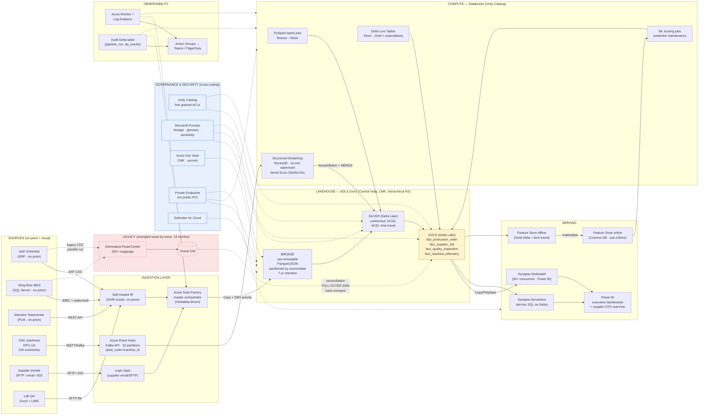

# Architecture Diagram — Chandan Aerospace Lakehouse on Azure

End-to-end view: sources on the left, medallion lakehouse in the centre, serving and AI/ML on the right, governance + security + observability cutting across. Legacy Informatica + Oracle DW are shown being **strangled** wave by wave (dashed boundary).

## Reading the diagram

- **Solid arrows** = production data path (steady state).
- **Dashed arrows** = transitional state — legacy systems still running in parallel during the 18-month Strangler Fig migration. Reconciliation arrow (Oracle DW ↔ Gold) is the *control gate* for each cutover.
- **Cross-cutting layers** (Governance, Security, Observability) are not in-line with the data path because every production component depends on them; in-line edges would obscure the read.
- Two ML edges matter: offline feature store reads Gold with time-travel for point-in-time training-set correctness; online store (Cosmos DB) is materialised for sub-100 ms inference and feeds back into Databricks ML scoring.
- Streaming and batch share the *same* Silver/Gold tables — that's the unification the brief asks for. There is no separate streaming warehouse.

## What the diagram deliberately *does not* show

- Branch-level ADF pipeline structure (parent + Lookup + ForEach + Switch) — covered in `02_design_document.md` §6 and `poc/adf/pipelines/master_orchestrator_pipeline.json`.
- Per-table SCD2 mechanics — covered in `poc/databricks/lib/scd_helpers.py`.
- DR topology (paired region) — covered in §9 of design doc with RTO/RPO.

The intent is one diagram a reviewer can hold in their head, not a 50-box BAU runbook.
