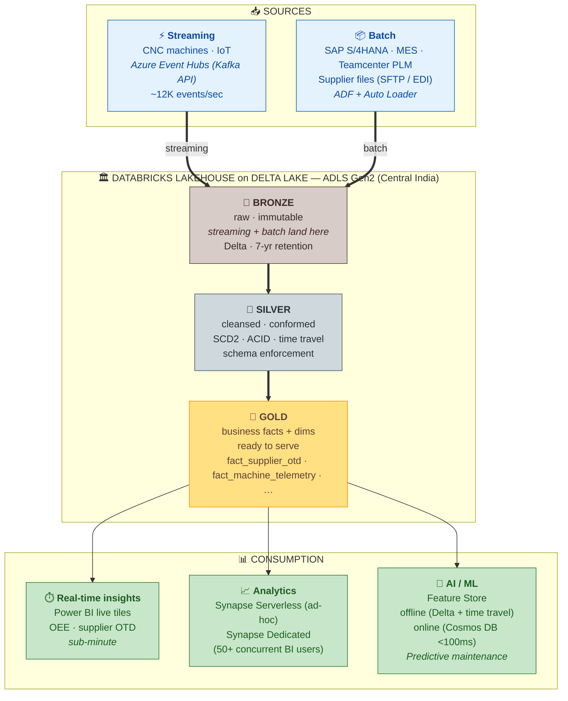

# Architecture Diagram — Chandan Aerospace Lakehouse on Azure

A simple, end-to-end picture: streaming **and** batch land into the same **Databricks Medallion Lakehouse on Delta Lake**, and Gold serves three consumers — the three things the brief asked for: **real-time insights, analytics, and AI/ML**.

## Reading guide — how this addresses the brief

| Brief asks for… | How the diagram answers it |
| -- | -- |
| **Unify streaming and batch data** | Both arrows (streaming and batch) terminate at the **same Bronze** table. From there, *one* set of Silver and Gold tables serve everything. There is no separate streaming warehouse and batch warehouse — that's the unification, made literal in the storage layer. |
| **Real-time insights** | Streaming feeds Bronze→Silver→Gold continuously (Databricks Structured Streaming + DLT). Sub-minute Gold means Power BI tiles for OEE and supplier OTD refresh inside one minute of an event happening on the shop floor. |
| **Support analytics** | Gold is queried two ways — **Synapse Serverless** for ad-hoc SQL (pay per TB, no movement) and **Synapse Dedicated** for the executive Power BI dashboards (50+ concurrent users, predictable concurrency). Both read Delta natively. |
| **Prepare data for AI/ML** | Gold *is* the offline feature store — Delta time travel gives point-in-time correctness for training sets for free. An online materialisation in **Cosmos DB** serves sub-100 ms inference. Predictions write back to Gold so they join with operational data. |

## Why Delta Lake makes the medallion work

- **Streaming + batch on the same table** — Delta supports both readers/writers concurrently with ACID guarantees. A streaming job and a daily batch job can both write Bronze without locking each other out.
- **Time travel + schema evolution** — `VERSION AS OF` is what lets us re-derive Silver from Bronze if a transformation bug is found, and what gives the AS9100 auditor "show me what this row looked like last Tuesday" for free.
- **MERGE + `apply_changes`** — Idempotent writes (re-running a micro-batch is safe) and one-line SCD2 inside Lakeflow Declarative Pipelines (DLT).
- **Open format** — Synapse Serverless reads Delta directly, no metastore movement, no shim.

## What this diagram deliberately does *not* show

To keep the picture readable, three cross-cutting concerns are described in `02_design_document.md` instead of drawn here:

- **Governance & lineage** — Unity Catalog (catalog/schema/table ACLs + column masks), Microsoft Purview (Bronze→Source lineage for AS9100 audit). See §6.6.
- **Security perimeter** — Key Vault CMK, managed identities only, Private Endpoints on every data-plane service, RLS in Synapse, Defender for Cloud. See §6.6.
- **Observability** — Azure Monitor + Log Analytics + a custom audit Delta table (`PipelineRun` chassis) that drives the SLO dashboards. See §9.

A more detailed view that shows these layers, the SHIR for on-prem connectivity, and the Strangler-Fig migration path against the legacy Informatica + Oracle DW estate is available in earlier revisions of this file (in git history) and is referenced by section in the design document.

## Two-pattern processing inside the lakehouse

The Bronze→Silver→Gold flow runs on **two complementary patterns** inside Databricks. Both produce Delta tables — same medallion, different code styles:

1. **Declarative — Lakeflow Declarative Pipelines (DLT)** — `poc/databricks/pipelines/unified_medallion_dlt.py`. One pipeline ingests *both* streaming (Event Hubs) and batch (Auto Loader on SAP files), applies the three DLT severity tiers (`expect_or_fail` / `expect_or_drop` / `expect`), runs SCD2 via `apply_changes`. Best for fresh, end-to-end unified flows.
2. **Imperative — PySpark notebooks** — `poc/databricks/notebooks/01_*`, `02_*`, `04_*`. Wrapped in a `PipelineRun` audit chassis (lock + watermark + structured audit row) for explicit run-metadata audit trails. Best for source-specific transformations (e.g. SAP timezone normalisation) and complex Structured Streaming features DLT doesn't yet expose.

The decision rule and rationale are in design-doc §4.3.
